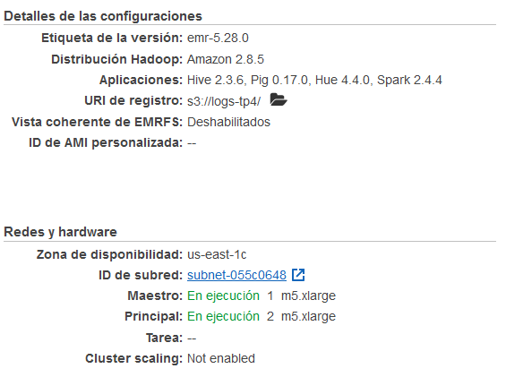

# TP4 - Servicios en la nube

## Jorge Pablo Ávila Gómez

## 1. Introducción

En este trabajo se va a abordar la implementación de un benchmark para evaluar un despliegue basado en Spark en la nube.

 En este caso se ha elegido el bechmark *terasort*, proporcionado por el equipo docente y se va a implementar en Amazon Web Services (AWS).

[ehiggs/spark-terasort](https://github.com/ehiggs/spark-terasort)

## 2. Preparación del clúster de trabajo en AWS

Para poder implementar el bechmark, primero hay que tener preparado el entorno de trabajo en AWS. Para ello se ha seguido una serie de pasos:

- Creación de la cuenta AWS educate

El primer paso ha sido crear una cuenta en AWS educate para obtener el crédito necesario para poder usar los diferentes recursos que vamos a utilizar. Para ello se siguió las instrucciones proporcionadas por el equipo docente en el plan de trabajo de la asignatura. 

- Obtención de clave para conexión por SSH

Se siguió el tutorial de AWS para obtener un par de claves que permitan la conexión al clúster por SSH.

[Amazon EC2 key pairs and Linux instances](https://docs.aws.amazon.com/AWSEC2/latest/UserGuide/ec2-key-pairs.html#having-ec2-create-your-key-pair)

 Posteriormente se probó y se consiguió realizar una conexión por SSH al clúster usando putty. Sin embargo, para la implementación del benchmark no se usó la conexión.

- Creación de bucket en S3

Se ha usado el servicio S3 como almacenamiento. Se siguió el tutorial de AWS para la creación de los buckets.

[How do I create an S3 Bucket?](https://docs.aws.amazon.com/AmazonS3/latest/user-guide/create-bucket.html)

Se han usado dos buckets, uno para almacenar los logs generados por los clústeres (`s3://logs-tp4`) y otro donde se almacena los archivos del beachmark (`s3://tp4-terasort`).

- Creación del clúster en EMR

Finalmente, para la preparación del clúster en Spark se usó el servicio EMR siguiendo el tutorial:

[Tutorial: Getting Started with Amazon EMR](https://docs.aws.amazon.com/emr/latest/ManagementGuide/emr-gs.html)

Para una primera implementación del clúster se usaron principalmente los ajustes por defecto. Sin embargo, se cambió a la versión *emr-5.28.0* la cual incluye la versión de Spark 2.4.4, que es la versión compatible con el bechmark *terasort.* 

El número de nodos se dejó por defecto en 1 máster y dos esclavos. Se indicó la ruta `s3://logs-tp4` donde se guardarán los logs. Y se añadió la clave EC2 creada para poder usar conexiones por SSH.



Resumen de la configuración utilizada para el clúster.

- Otros servicios que se han intentado utilizar.

Se intentó configurar AWS Cli para poder comunicarse con S3 y de ese modo poder subir y descargar archivos y carpetas desde la línea de comandos. Sin embargo, después de varias horas peleándome con la instalación de los credenciales necesarios para poder usar la herramienta se decidió no utilizarla.

La principal motivación para el uso de la herramienta fue que desde la página web solo se pueden descargar archivos de uno en uno y tampoco permite buscar dentro de las carpetas. Esto fue un inconveniente porque, como veremos más adelante, se tuvo que buscar entre la multitud de archivos de logs donde se encontraba el stdout.

## 3. Implementación del bechmark *terasort*

El bechmark terasort consiste en evaluar el rendimiento de un sistema midiendo su capacidad para ordenar una cierta cantidad de datos lo más rápidamente posible.

El bechmark que vamos a utilizar está basado en Spark, y hay que utilizar la version 2.4.4. Se incluyen tres pasos, el primero es la generación de los datos, se puede indicar arbitrariamente cuantos datos queremos generar, para el ejemplo inicial usaremos 1000 MB. El segundo paso es la ordenación de los datos. Y el tercer paso es la evaluación de la ordenación para comprobar que no ha habido errores durante el paso anterior.

Pasos para la implementación:

- Instalación de Maven

El primer paso ha sido la instalación de Maven, se hizo en Ubuntu con el comando `sudo apt install maven`.

- Ejecución de Maven

Para la generación del proyecto y de los diferentes archivos que necesitamos para ejecutar el bechmark tenemos que ejecutar Maven. Para ello en la carpeta donde se encuentra descargado el repositorio del bechmark terasort se ejecutó el comando: `mvn install`, tal y como se indica en el repositorio de github.

- Subir bechmark a S3

El siguiente paso fue subir todos los archivos de bechmark a S3. Para ello se utilizó la interfaz de la página web y se añadieron todos los archivos al bucket `s3://tp4-terasort`.

- Ejecución del bechmark

La ejecución se realizó usando pasos, tres en total, uno para la generación de los datos, otro para el ordenamiento y finalmente para la evaluación. La realización de este paso no fue trivial y se realizaron muchas pruebas de ejecución hasta que se entendió que los pasos de aplicaciones en Spark se corresponde con ejecuciones de spark-submit, que es como se detalla en la documentación del bechmark.

- Generación de los datos

Siguiendo el comando que se incluye en la documentación del repositorio, se creó un paso de aplicación en Spark de nombre *generate-data.* En el apartado de *Opciones de spark-submit*  se indicó `--class com.github.ehiggs.spark.terasort.TeraGen` como aparece en la documentación. Y en los argumentos `1g s3://tp4-terasort/generate-data` que se corresponde con que se van a generar 1 GB de datos y la dirección donde se van a guardar.

En la ubicación de la aplicación seleccionamos la carpeta en S3 donde se encuentra el archivo: `s3://tp4-terasort/spark-terasort-master/target/spark-terasort-1.2-SNAPSHOT-jar-with-dependencies.jar`

Usando esta configuración se consigue que el paso se ejecute correctamente. En la carpeta `s3://tp4-terasort/generate-data` podemos ver los resultados obtenidos. Tenemos un archivo que se llama *_SUCCESS* que nos indica que la ejecución se ha realizado con éxito, y  los datos divididos en dos archivos de cerca de 500 MB cada uno.


En el stdout de la ejecución es:

```python
===========================================================================
===========================================================================
Input size: 1000MB
Total number of records: 10000000
Number of output partitions: 2
Number of records/output partition: 5000000
===========================================================================
===========================================================================
Number of records written: 10000000
```

Que nos indica efectivamente que se han generado 1000 MB de datos divididos en dos particiones de 500 MB cada una.

Encontrar el stdout fue complicado porque no aparece como log del paso. Para encontrarlo hay que ir hasta la siguiente dirección en los logs del clúster: `s3://logs-tp4/j-3QXXT40EHHWEH/containers/application_1611929937668_0001/container_1611929937668_0001_01_000001/stdout.gz` Parece que se genera dentro del Id del clúster, luego dentro de la carpeta container, dentro de esta para cada paso hay una carpeta de aplicación, y dentro varias carpetas de container donde dentro de una de ellas está el stdout esperado. Para encontrarlo hubo que ir buscándolo carpeta por carpeta hasta que se encontró.

- Ordenación de los datos

Para ejecutar el paso de la ordenación se indicaron los siguientes comandos. Se creó un paso de aplicación en Spark de nombre *sort-data.* En el apartado de *Opciones de spark-submit* se indicó `--class com.github.ehiggs.spark.terasort.TeraSort` como aparece en la documentación. Y en los argumentos `s3://tp4-terasort/generate-data s3://tp4-terasort/sort-data` que se corresponde con la carpeta en S3 donde están los datos generados en el paso anterior, y la carpeta donde queremos que guarde los resultados. Igual que en el paso anterior se selecciona la aplicación: `s3://tp4-terasort/spark-terasort-master/target/spark-terasort-1.2-SNAPSHOT-jar-with-dependencies.jar`.

Usando esta configuración se consigue que el paso se ejecute correctamente. En la carpeta `s3://tp4-terasort/sort-data` podemos ver los resultados obtenidos. Tenemos un archivo que se llama *_SUCCESS* que nos indica que la ejecución se ha realizado con éxito, y  los datos ordenados divididos en 16 partes.


Este paso no genera ningún stdout.

- Evaluación

Para la evaluación se realiza otro paso de aplicación de Spark con los siguientes parámetros como se indica en la documentación del benchmark. En el apartado de *Opciones de spark-submit*  se indica `--class com.github.ehiggs.spark.terasort.TeraValidate` como aparece en la documentación. Y en los argumentos `s3://tp4-terasort/sort-data s3://tp4-terasort/validation` que se corresponde con la carpeta en S3 donde están los datos ordenados generados en el paso anterior, y la carpeta donde queremos que guarde los resultados. Igual que en el paso anterior se selecciona la aplicación: `s3://tp4-terasort/spark-terasort-master/target/spark-terasort-1.2-SNAPSHOT-jar-with-dependencies.jar`.

Usando esta configuración el paso se ejecuta correctamente sin obtener ningún error. Sin embargo, este no genera ningún archivo. Viendo el repositorio del benchmark, encontré un issue cerrado donde se preguntaba como se obtenía la salida de la evaluación, pero no se llegó a concretar una respuesta y simplemente se indicaba que se debería generar.  Por otro lado, observando el código del archivo *TeraValidate.scala* parece que no está preparado para escribir una respuesta.

Como vemos en la imagen solo espera un argumento que es la carpeta donde están los datos ordenados.


Por otro lado, el stdout de este paso es el siguiente:

```python
num records: 10000000
checksum: 4c48c175ea9cd9
part 0
lastMaxArrayBuffer(0, 0, 0, 0, 0, 0, 0, 0, 0, 0)
min ArrayBuffer(0, 0, 2, 160, 226, 23, 215, 56, 215, 118)
max ArrayBuffer(15, 255, 249, 148, 135, 38, 194, 9, 160, 100)
part 1
lastMaxArrayBuffer(15, 255, 249, 148, 135, 38, 194, 9, 160, 100)
min ArrayBuffer(16, 0, 0, 207, 147, 185, 222, 95, 220, 153)
max ArrayBuffer(31, 255, 247, 137, 23, 3, 173, 126, 1, 215)
...
...
part 15
lastMaxArrayBuffer(239, 255, 253, 49, 241, 206, 3, 98, 79, 158)
min ArrayBuffer(240, 0, 3, 197, 198, 150, 130, 60, 101, 124)
max ArrayBuffer(255, 255, 255, 245, 151, 226, 124, 67, 172, 147)
num records: 10000000
checksum: 4c48c175ea9cd9
partitions are properly sorted
```

Parece que realiza una comprobación de cada parte y finalmente escribe que todas las particiones están correctamente ordenadas.

En la documentación de este benchmark no se explica como interpretar los resultados o si estos son todos los resultados que se obtienen. Por tanto, para poder comparar entre distintas configuraciones de clústeres se decidió utilizar el tiempo de ejecución de la tarea de ordenamiento. Este número debería ser indicativo de la potencia del clúster para hacer la tarea de ordenación.

Este número lo obtenemos en la pestaña historial de aplicaciones del clúster en EMR. Vemos que para esta configuración este clúster ha tardado 49 segundos.


## 4. Comparación entre diferentes clústeres

En este apartado se va a comentar como realizaron esta tarea diferentes configuraciones del clúster.

- 10 GB de datos

Lo primero que se intentó fue aumentar la cantidad de datos que tiene que ordenar. Usando el argumento 10g en el paso de generación de los datos se consigue que el clúster tenga que ordenar 10 GB de datos.

El paso de generación crea dos archivos de 5 GB que son los que serán ordenados.

La tarea de ordenación tarda en ejecutarse 5.0 minutos.

La evaluación indica que los datos fueron ordenados correctamente.

- 100 GB de datos

No se llegó a completar la tarea de ordenación. Se intentó varias veces, pero uno de los nodos dejaba de funcionar y el clúster se paralizaba.

Se producía el siguiente error en la tarea 1386 y el clúster no era capaz de recuperarse.


Puede que el problema estuviese en que cada nodo tiene 64 GB de almacenamiento, y como se trabajaba con 100 GB de datos no se pudiese trabajar con todos a la vez.

Para el resto de comparaciones se van a usar 10 GB de datos.

- 1 maestro y 4 instancias

Se modifica la configuración del clúster para pasar de 2 a 4 instancias.


Al duplicar el número de instancias se reduce el tiempo de ejecución de 5 min a 1,9 min.

- 1 maestro y 7 instancias

Se aumenta el número de instancias hasta 7 que es el máximo que nos ha permitido. Se realiza el mismo trabajo sort y en este caso el tiempo de ejecución es de 1.1 min.

Por tanto observamos que al aumentar el número de instancias se hacen más trabajos en paralelo y se requiere menos tiempo.

- Instancias tipo m5.2xlarge

Se prueban instancias de tipo m5.2xlarge,  que tiene 8 núcleos y 32 GB de memoria. Solo se nos permite tener dos instancias y un maestro.


Esta configuración tarda 1.6 min  reduciendo el tiempo de la configuración m5.xlarge de 5 min (4 vCore, memoria de 16 GB).

- Instancias tipo m4.large

Se prueban instancias de tipo m4.large,  que tiene 2 núcleos y 8 GB de memoria. Se ejecutan dos instancias y un maestro para comparar con los procesos anteriores.


Esta configuración tarda 9.8 min  aumentando el tiempo de la configuración m5.xlarge de 5 min (4 vCore, memoria de 16 GB).

- Otras configuraciones

Se intentan probar otras configuraciones, pero parece que la cuenta educate está bastante limitada y no he podido probar clústeres con otras configuraciones, sobre todo clústeres más potentes.

## 5. Conclusiones

En este trabajo se han desplegado diferentes clústeres de aws EMR en los que se ha ejecutado el benchmark terasort. Para almacenar los datos necesarios se ha usado el servicio s3.

Entre las diferentes ejecuciones realizadas, podemos observar que al aumentar el tamaño de los datos que deben ser ordenados el tiempo de ejecución aumenta.

También hemos observado que al aumentar el número de nodos el tiempo de ejecución disminuye, pasando de 5 min a 1.9 min y 1.1 min, para 2, 4 y 7 nodos. 

Con respecto a las características de cada nodo, se han probado nodos de 2 núcleos y 8 GB de memoria, 4 núcleo y 16 GB y, 8 núcleos y 32 GB; obteniéndose los siguientes tiempos usando 1 master y dos esclavos en cada caso: 9.8 min, 5 min y 1.6 min, respectivamente. Observamos que mejorando las características de los nodos, los tiempos de ejecución se reducen significativamente.
