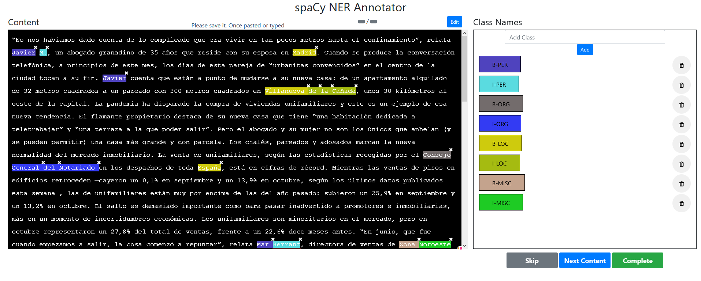

# Tarea 1. Minería de textos Opcional

# 1. Objetivos

Los objetivos de esta tarea opcional son: realizar un anotado manual de un texto y evaluar los resultados de la predicción del anotado automático.

# 2. Herramientas utilizadas

Para esta parte se ha elegido como texto un artículo del periódico El País que trata sobre la situación inmobiliaria de España tras la crisis del coronavirus. Se puede acceder al artículo mediante el siguiente link:

[El éxodo del coronavirus: de la ciudad al unifamiliar](https://elpais.com/economia/2020-12-12/el-exodo-del-coronavirus-de-la-ciudad-al-unifamiliar.html?rel=lom)

Por otro lado, para realizar el etiquetado se ha optado por una herramienta online que facilita la tarea. Es un annotator al cual se puede acceder mediante el navegador web. Dentro de la web se sube el texto que se quiere anotar y se indican las diferentes etiquetas. Finalmente, se van señalando en el texto las diferentes entidades, y cuando se ha terminado de etiquetar se puede descargar el texto etiquetado en formato *JSON.*

Al annotator se puede acceder mediante su repositorio en github. 

[ManivannanMurugavel/spacy-ner-annotator](https://github.com/ManivannanMurugavel/spacy-ner-annotator)

Para las anotaciones se ha usado directamente el formato IOB, usando las mismas etiquetas que en el primer ejercicio. En la siguiente imagen se puede ver el annotator con el texto y algunas etiquetas marcadas.



Ejemplo de uso del spacy-ner-annotator durante la realización de este ejercicio.

# 3. Resultados

## 3.1 Obtención de los resultados

Para obtener las predicciones se ha procedido de manera similar al ejercicio uno. Se ha usado el mismo modelo de `spaCy` (`"es_core_news_lg"`), aunque en este caso no se ha usado ningún tokenizador personalizado.

Primero se ha cargado el archivo JSON con las etiquetas. La estructura del archivo es un diccionario con dos llaves, `content` que incluye el texto sin etiquetar, y `entities` que es una lista de todas las entidades. El archivo JSON se ha obtenido a partir del spaCy NER Annotator como se ha explicado en la parte anterior.

Al modelo de `spaCy` le pasamos el texto sin etiquetar para que nos devuelva sus predicciones.

```python
import json
import spacy

nlp = spacy.load("es_core_news_lg")

# Etiquetado realizado manualmente
with open('ej2etiquetas.json', encoding='utf-8') as f:
    data = json.load(f)[0]

# Predicción
doc = nlp(data['content'])
```

Una vez obtenidas las predicciones se prepara un archivo con el formato adecuado para el script *conlleval.py*. Se itera entre todas las palabras del documento Para cada palabra, si esta fue etiquetada manualmente se añade su etiqueta, en caso contrario, se añade la etiqueta `'O'`. A continuación, se añade la predicción correspondiente.

```python
# Preparación del documento para conlleval.py
pos_label = -1  # en el etiquetado están ordenadas de la última a la primera
f = open('solution_ej2', 'w', encoding='utf-8')
for item in doc:
    name = item.text  # la palabra
    # etiqueta verdadera
    if data['entities'][pos_label][0] == item.idx:  # entidad
        gold = data['entities'][pos_label][2]
        if data['entities'][pos_label] == data['entities'][0]:
            pos_label = 0
        else:
            pos_label -= 1
    else:  # si no aparece se considera como 'O'
        gold = 'O'
    # predición de modelo
    if item.ent_type_ == '':
        pred = item.ent_iob_
    else:
        pred = item.ent_iob_+'-'+item.ent_type_
    f.write(name + ' ' + gold + ' ' + pred + '\n')
f.close()
```

## 3.2 Análisis de los errores

Al analizar el documento con las anotaciones realizadas se encuentra principalmente un tipo de error. El modelo clasifica erróneamente como entidades las palabras después de un punto. Podemos observar algunos ejemplos: 

```python
. O O
La O B-MISC
pandemia O I-MISC

. O O
El O B-MISC
flamante O I-MISC
propietario O I-MISC

Pero O B-MISC
el O I-MISC
abogado O I-MISC
y O I-MISC
su O I-MISC
mujer O I-MISC
no O I-MISC

. O O
Los O B-MISC
chalés O I-MISC

. O O
El O B-MISC
salto O I-MISC

y muchos más
```

Este es el tipo de error más común que va a perjudicar mucho la puntuación. También fue encontrado en el ejercicio principal. Se postula que el origen de este error sea que los modelos de `spaCy` solo están diseñados para aceptar una sola frase. No se ha encontrado referencias a esto en la documentación. Además, sería poco práctico usar estos modelos en textos grandes si se tiene que dividir el texto en frases. Tarea que no es siempre trivial porque no siempre los puntos marchan el final de una frase.

Para paliar este problema se ha modificado ligeramente el código anterior para introducir un salto de línea después de cada punto:

```python
doc = nlp('.\n'.join(data['content'].split('.')))
```

Con este pequeño cambio se consigue evitar la mayoría de este tipo de error:

```python
. O O
La O O
pandemia O O

. O O
El O O
flamante O O
propietario O O

. O O
Pero O O
el O O
abogado O O
y O O
su O O
mujer O O

. O O
Los O B-LOC
chalés O I-LOC

. O O
El O B-MISC
salto O I-MISC
```

De todos los errores cometidos de este tipo solo uno continua tras la modificación (*El salto*) y otro sigue siendo clasificado erróneamente (*Los chalés),* pero ahora como localización y no como entidad miscelánea.

El resto de errores que comete el modelo son los siguientes:

```python
Mar B-PER B-LOC
Herranz I-PER I-LOC
```

*Mar Herranz* se clasifica como  localización y no como persona, tal vez por la palabra *Mar* que suele hacer referencia también a playas, mares o lugares.

```python
Zona B-MISC B-LOC
Noroeste I-MISC I-LOC
```

Este caso es especial porque se podría considerar una localización. Hubo dudas de como etiquetar esta entidad y se eligió MISC porque quizás hace más referencia a un departamento de la empresa que a un lugar. Aun así se tuvo dudas y es una etiqueta compleja. Como punto positivo el modelo la ha encontrado.

```python
Engel B-ORG B-LOC
& I-ORG I-LOC
Völkers I-ORG I-LOC
Madrid I-ORG I-LOC
```

Aquí el modelo ha confundido el nombre de la empresa con una localización, posiblemente porque el nombre de la empresa incluye la palabra *Madrid*.

```python
Fotocasa B-ORG B-PER
```

Ha confundido el portal *Fotocasa* con una persona.

```python

Para O O
Moody’s B-ORG B-LOC
```

Por último, el caso de *Moody's,* esta organización ha sido confundida con un lugar aunque, curiosamente en otras parte del texto esta misma organización ha sido clasificada correctamente.

Como resumen de los errores, podemos concluir que el modelo ha encontrado todas las entidades etiquetadas y solo ha clasificado erróneamente 5 de ellas (un total de 10 palabras mal). Además solo ha considerado como entidades 2 grupos que en realidad no lo son (añadiendo 4 palabras mal clasificadas).

En la siguiente tabla podemos ver los resultados estadísticos:

```python
processed 1060 tokens with 28 phrases; found: 30 phrases; correct: 23.
accuracy:  77.78%; (non-O)
accuracy:  98.68%; precision:  76.67%; recall:  82.14%; FB1:  79.31
              LOC: precision:  72.22%; recall: 100.00%; FB1:  83.87  18
             MISC: precision:   0.00%; recall:   0.00%; FB1:   0.00  1
              ORG: precision: 100.00%; recall:  57.14%; FB1:  72.73  4
              PER: precision:  85.71%; recall:  85.71%; FB1:  85.71  7
```

Vemos que el modelo presenta puntuaciones altas, con una precisión y recall mayores de 75%, y una exactitud del 98%. Esto da lugar a una puntuación F de 79,31.

# 4. Conclusiones

En este ejercicio se ha realizado un etiquetado manual de un artículo periodístico. Para ello se ha usado la herramienta spaCy NER annotator la cual permite realizar el etiquetado de manera interactiva en el navegador, facilitando la tarea.

Usando el mismo texto, se han obtenido las predicciones de un modelo pre-entrenado de `spaCy`. Ha llamado la atención el gran número de errores que comete el modelo después de los puntos y parece que no está preparado para tratar con textos largos. Este problema se suele solucionar bien añadiendo saltos de línea después de cada punto.

Finalmente, las predicciones se han comparado con las etiquetas, obteniendo un gran porcentaje de acierto. El modelo ha fallado etiquetando una entidad que no estaba clara en el etiquetado, pero el resto de fallos son evidentes y se suele encontrar fácilmente el motivo de error del modelo.

Como punto positivo el modelo ha encontrado todas las entidades aunque haya considerado categorías incorrectas en algunos casos.

Comparando con los resultados obtenidos en el ejercicio 1, en esta parte el modelo ha obtenido mejores resultados. Es cierto que el documento es mucho más pequeño comparado con el utilizado en el ejercicio 1 lo cual podría dificultar la comparación. Sin embargo, también se atribuye unos mejores resultados en esta parte a que el texto tenía un formato más amistoso para el modelo, por ejemplo no incluía palabras en mayúsculas, y a que el modelo ha clasificado usando sus propios tokens y no unos pre-asignados, como pasaba en la parte 1.

### Documentos relativos a este ejercicio:

- El texto sin etiquetar se encuentra en el archivo *ejercicio2.txt*
- El texto etiquetado en formato JSON se encuentra en el archivo *ej2etiquetas.json*
- El código para obtener las prediciones se encuentra en el archivo *ejercicio2.py*
- El código mejorado para evitar errores después de puntos *ejercicio2_mejorado.py*
- El documento con las predicciones para ser evaluadas es *solution_ej2* y *solociones_ej2_mej*
- Para obtener una lista de todos los errores se ha usado el archivo *detectar_errores.py*
- Documentos con los errores *erroresej2* y *erroresej2_mej*